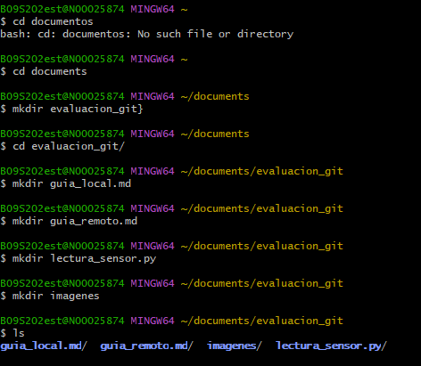

creacion de repositorio  
creacion de un repositori con git bash utilizando el comando cd para entar a documents y ahi crear la carpeta y los archivos correspondientes pedidos en la evaluaciom  

cd  documents  
mkdir evaluacion_guit  
touch guia_local.md  
ls  
 
  vim guia_local.md  
    
    
      
      entrar a git hub, hacer clic en el boton de +,escribir el nombre de repositorio. y darle el boton crear repositorio  
      tiene que hacer un git remode and origin y el link del repo para luego subir el trabajo por primera vez se utiliza git push -u origin main y luego para hacer cambios en la nube git push  
        
        git pull  
        git push  
          
           

